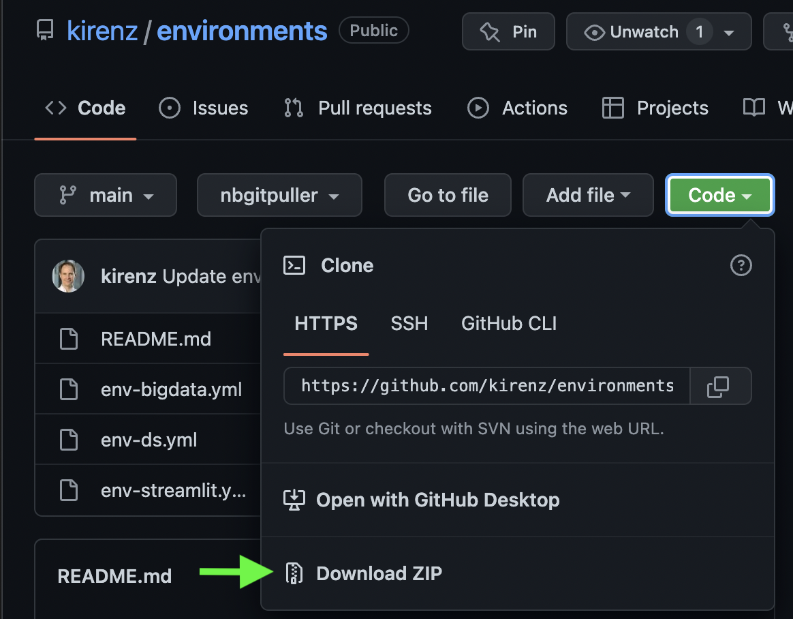

# Conda environment


## Install environment


- Step 1: Download this repository as zip-file:



---

- Step 2: Move the folder to a location (e.g. "MY_PATH") of your choice and unzip it.

---

- Step 3: Open your terminal and `cd` into the "environment" directory (replace MY_PATH with your path)

```bash
cd MY_PATH/environment
```

---

- Step 4: Replace the name "NAME_OF_ENVIRONMENT" with the environment of your choice (e.g. env-bigdata, env-ds, ...) 

```bash
conda env create -f NAME_OF_ENVIRONMENT.yml
```

That's it!

---

*If you want to use the environment, you simply need to type the name after "env", e.g. for "env-ds" ds:*

```bash
conda activate ds
```
